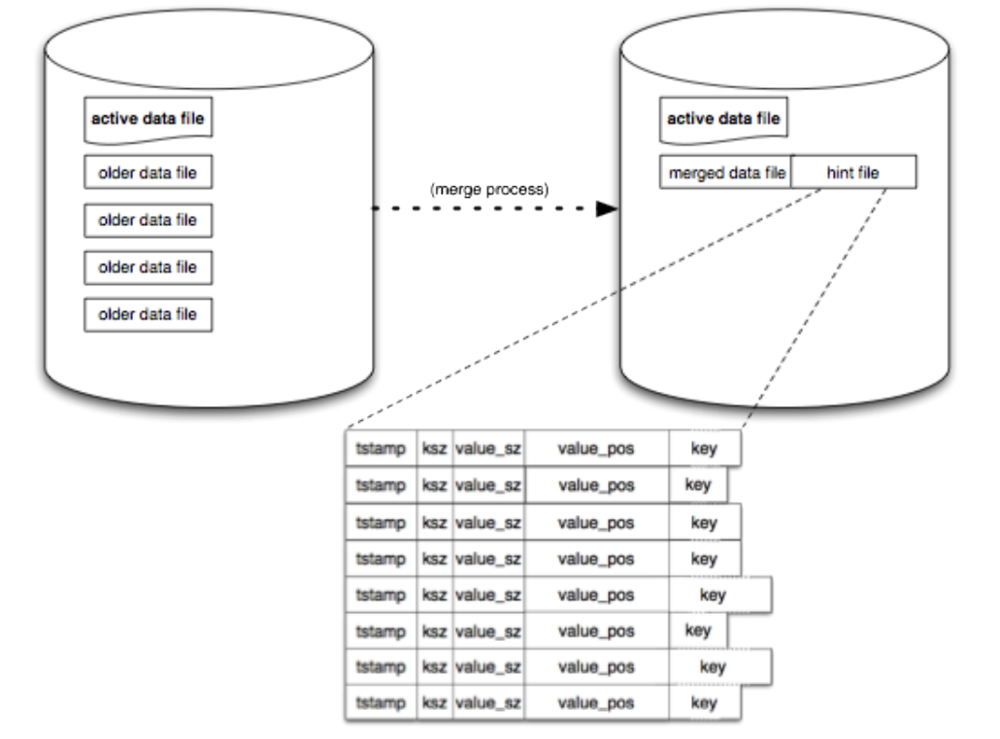

# Bitcask Go



Toy implementation of Bitcask in Golang using the intro [white paper](https://riak.com/assets/bitcask-intro.pdf)

## Motive

I learned about this log based KV store while reading through [Designing Data-Intensive Applications](https://dataintensive.net/), and I really wanted to dive a little more than what was mentioned in the textbook. As a result, I made this toy example, that admittedly is not the best and clearly doesn't support a lot of the key features at the moment. To be honest, I feel like I wrote some pretty bad code. Will need to fix a lot soon.

## Included Features

Current features include `GET`, `PUT`, `DELETE`, `KEYS`, and `MERGE`. I also made it possible to initialize from a preexisting Bitcask directory.

## Missing Features

At the moment I have yet to implement any concurrency, which I feel is really important to do in the future. Also haven't gotten to making the hint files for `MERGE` yet, either. There are other functions as well that I have yet to implement, but I won't state them all here.

## Usage

For now, I have everything usable via the cli. For the most basic usage do the following command

```bash
go run . <directory-name>
```

Now, you have a shell-like interface to run some Bitcask commands manually

```bash
> KEYS
NO KEYS
> GET TEST
NULL
> PUT TEST HI
PUT TEST SUCCESSFULLY
> GET TEST
HI
> PUT TEST BYE
PUT TEST SUCCESSFULLY
> GET TEST
BYE
> KEYS
TEST
> DELETE TEST
DELETE TEST SUCCESSFULLY
> GET TEST
NULL
> KEYS
NO KEYS
```